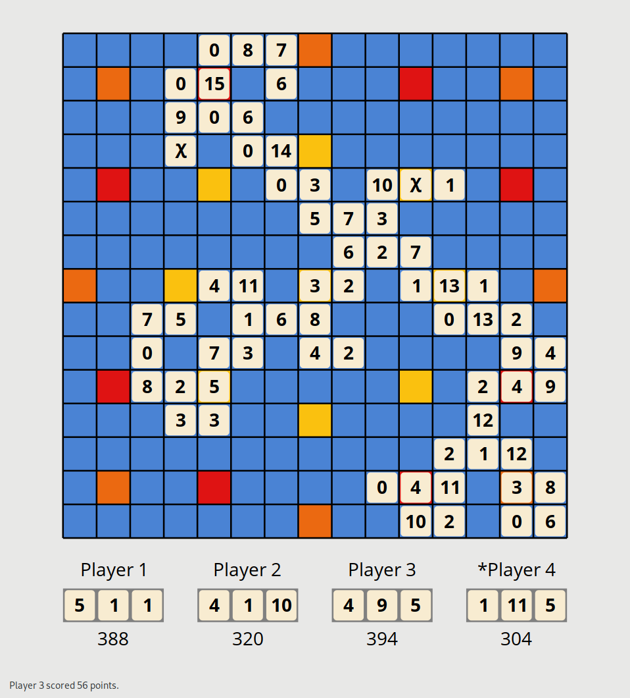

# Triolet

This is a simple simulation of the board game Triolet, written in Haskell.



## Basic rules

Triolet basically is "Scrabble with numbers".
The game revolves around on the three following simple constraints:

- at most 3 tiles can be aligned adjacently;
- the sum of adjacent aligned tiles must not exceed 15;
- the sum of 3 adjacent aligned tiles must be equal to 15.

Completing adjacent alignments of 3 tiles is the main objective as it doubles the points earned from the alignment.
You can find more information about the game at [BoardGameGeek](https://boardgamegeek.com/boardgame/13103/triolet).

## Status

All the game mechanics are implemented.
Only the computer is playing, and it does so naively: it simply maximizes its points at each turn.

## Build and run

```
cabal new-run triolet
```

Press any key to advance the simulation.
